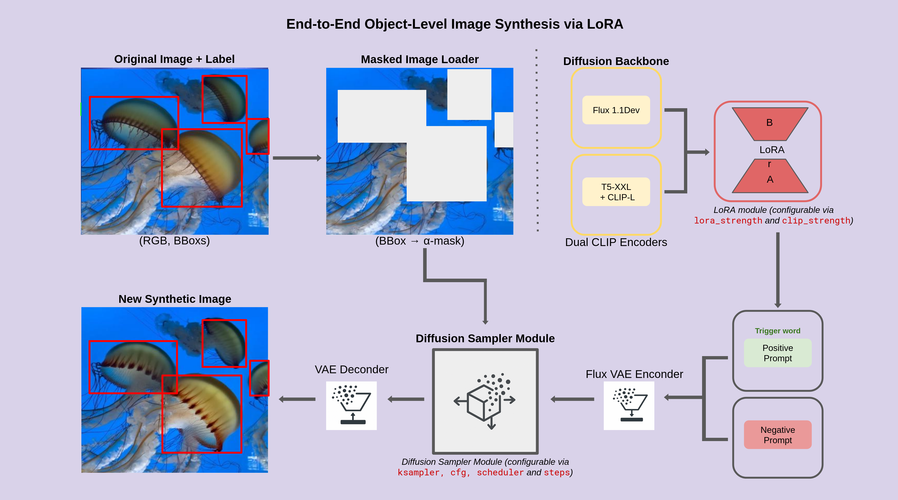

# FLORA - YOLO Dataset Augmentation with LoRA & ComfyUI



## Overview

FLORA is a Python tool for augmenting YOLO datasets using inpainting with LoRA models via ComfyUI. It is highly optimized and easy to use. This README will guide you through environment setup and running the main script.

---

## 1. Environment Setup

All environment setup instructions and files are in the [`env/`](env/) folder.

### 1.1. Create Conda Environment

- The file [`env/flora.yml`](env/flora.yml) defines the required packages.
- To create the environment, run:

```sh
conda env create -f env/flora.yml
conda activate flora
```

### 1.2. Models Download

Before running the project, download the following models and place them in the correct folders:

#### 🔹 UNet (FLUX)
Download and place inside the `UNET/` folder:
- [FLUX.1-dev](https://huggingface.co/black-forest-labs/FLUX.1-dev/tree/main)
- [FLUX.1-Fill-dev](https://huggingface.co/black-forest-labs/FLUX.1-Fill-dev/tree/main)

#### 🔹 CLIP
Download from [Flux Text Encoders](https://huggingface.co/comfyanonymous/flux_text_encoders/tree/main) and place inside the `CLIP/` folder.

Required files:
- `t5xxl_fp8_e4m3fn.safetensors`
- `t5xxl_fp16.safetensors`

#### 🔹 VAE
Download and place inside the `VAE/` folder:
- [flux_vae.safetensors](https://huggingface.co/StableDiffusionVN/Flux/blob/main/Vae/flux_vae.safetensors)

#### 🔹 LoRAs
Place all your LoRA files inside the `loras/` folder.

https://drive.google.com/drive/folders/1bczkgciGCLr4cANbfkvnT1wLr-D_a-nq?usp=sharing

---

## 2. Running FLORA

The main script is [`lora_fast.py`](lora_fast.py). It is optimized for speed and batch processing.

### 2.1. Prepare Your Dataset

- Your input dataset should have the following structure:   (labels should be in yolov7 format)
  ```
  input/
    images/
      image1.jpg
      image2.jpg
      ...
    labels/
      image1.txt
      image2.txt
      ...
  ```

### 2.2. Run the Script

Use the following command template:

```sh
python lora_fast.py \
  --input input \
  --output output_augmented \
  --k 3 \
  --target-class 0 \
  --prompt "your positive prompt here" \
  --negative-prompt "your negative prompt here" \
  --lora-name "your_lora_model.safetensors" \
  --lora-strength-model 1.0 \
  --lora-strength-clip 1.0 \
  --guidance 6.5 \
  --steps 15
```

#### Arguments

- `--input`: Path to your dataset folder (must contain `images/` and `labels/`).
- `--output`: Output folder for augmented dataset.
- `--k`: Number of augmentations per image.
- `--target-class`: YOLO class ID to use for inpainting.
- `--prompt`: Positive prompt for generation.
- `--negative-prompt`: Negative prompt (default: `"blurry, low quality, cartoon, watermark, signature"`).
- `--lora-name`: Filename of your LoRA model.
- `--lora-strength-model`: LoRA strength for UNET (default: `1.0`).
- `--lora-strength-clip`: LoRA strength for CLIP (default: `1.0`).
- `--guidance`: CFG scale (default: `6.5`).
- `--steps`: Number of sampling steps (default: `15`).
- `--no-originals`: (Optional) Exclude original images/labels from output.

---

## 3. Output

- Augmented images and labels will be saved in the specified output directory, under `images/` and `labels/`.

---

## 4. Troubleshooting

- Make sure your Conda environment is activated before running the script.
- Check that all required models (LoRA, VAE, UNET, CLIP) are available in the correct paths.
- For GPU/OpenCV issues, see [custom_nodes/ComfyUI-Impact-Pack/troubleshooting/TROUBLESHOOTING.md](custom_nodes/ComfyUI-Impact-Pack/troubleshooting/TROUBLESHOOTING.md).

---

## 5. License

MIT © Argos Lab, 2025

---

## 6. Contact

For questions or issues, contact the author or open an issue in the repository, he is a nice guy 😀

---

## 7. Example: MRI Dataset

To test the environment and see a full run example, you can use the included **MRI dataset** together with the provided LoRA model. (they are inside the google drive)

Run the following command:

```sh
python lora_fast.py \
  --input mri_train_200 \
  --output output \
  --k 3 \
  --target-class 0 \
  --prompt "MRI_POSITIVE" \
  --negative-prompt "blurry, low quality, cartoon, watermark, signature" \
  --lora-name "lora_mri.safetensors" \
  --lora-strength-model 1.0 \
  --lora-strength-clip 1.0 \
  --guidance 6.5 \
  --steps 15
```

This example uses:
- Dataset: `mri_train_200`
- LoRA: `lora_mri.safetensors`
- Target class: `0` (replace with your actual MRI label if needed)

The generated augmented dataset will be available in the `output/` folder.